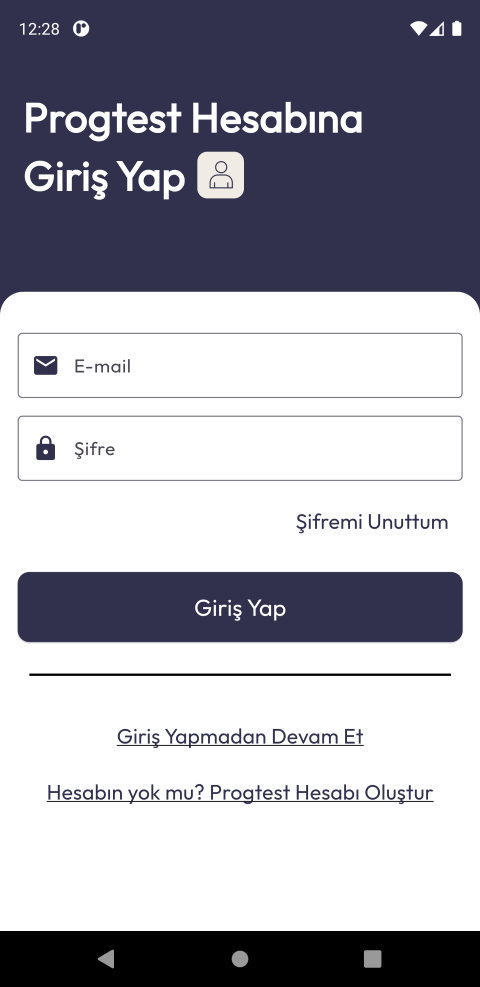

<div align="center">


# ProgTest

### AI-Powered Quiz & Learning App for Software Developers

A full-stack mobile application — **Flutter** front-end + a **custom ASP.NET Core Web API** back-end — that helps programming students and enthusiasts test their knowledge, track their progress, and learn with the help of generative AI.

[](https://play.google.com/store/apps/details?id=com.yusufUguz.progtest)
&nbsp;


</div>

> **Designed, developed, deployed and published by [Yusuf Uğuz](https://github.com/YusufUguz)** — both the Flutter mobile client **and** the back-end Web API are written from scratch, and the app is **live on Google Play**.

---

## 📑 Table of Contents

- [Overview](#-overview)
- [Features](#-features)
- [AI Capabilities](#-ai-capabilities)
- [Tech Stack](#-tech-stack)
- [Architecture](#-architecture)
- [Project Structure](#-project-structure)
- [How the App & API Work Together](#-how-the-app--api-work-together)
- [Efficient Use of Flutter's Widget Tree](#-efficient-use-of-flutters-widget-tree)
- [Backend — ASP.NET Core Web API](#-backend--aspnet-core-web-api)
- [Screenshots](#-screenshots)
- [Publishing to Google Play](#-publishing-to-google-play)
- [Getting Started](#-getting-started)
- [What This Project Demonstrates](#-what-this-project-demonstrates)
- [Author](#-author)

---

## 🎯 Overview

**ProgTest** is an end-to-end product, not just a UI demo. The target audience is high-school and university students (and anyone) studying or interested in software and programming. Users review what they have learned by solving quizzes, see detailed statistics about their performance, and get help from a generative-AI assistant in several different modes.

The application is fully **authentication-based**: users register and sign in against a custom **ASP.NET Core Identity** back-end. Guests can browse with limited access. All quiz content, results and statistics are persisted in a **Microsoft SQL Server** database through a self-built **RESTful Web API** ([progtest.yusufuguz.com](https://progtest.yusufuguz.com/swagger/index.html)).

---

## ✨ Features

- 🔐 **Authentication & Authorization** — Register / login flow backed by ASP.NET Core Identity; JWT-based session handling; optional guest mode with restricted access.
- 🗂️ **Categories → Tests → Questions** — Browse programming categories, pick a test, and answer questions one by one in a dedicated quiz flow.
- 📊 **Result & Statistics Screen** — After each test the user sees a results screen (correct/incorrect counts, time spent, score) which is persisted per-user in the database.
- 👤 **Profile & Aggregate Stats** — View name & e-mail, change password, sign out, and see lifetime statistics (total tests solved, total correct/incorrect, average score).
- 🤖 **AI Assistant** — Eight different Gemini-powered AI experiences (see below).
- 💬 **User Feedback** — Users can submit feedback that is stored through the API.
- 🌐 **Custom Back-end** — Every endpoint is served by a personally developed and deployed Web API, not a BaaS.

---

## 🤖 AI Capabilities

Powered by Google's **Gemini 1.5 Flash** model via the `google_generative_ai` package, the AI page offers eight distinct experiences:

| # | Feature | Description |
|---|---------|-------------|
| 1 | **Ask the AI** | Simplest mode — single prompt in, single answer out. |
| 2 | **Chat with AI** | A continuous, stateful chat session instead of one-shot queries. |
| 3 | **Ask with an Image** | Multimodal — attach an image + a prompt and ask about it. |
| 4 | **Work on a Document** | Pick a document, send it with a prompt, and reason over its contents. |
| 5 | **Generate a Test with AI** | A fixed engineered prompt turns a single topic into 10 structured questions, which are parsed and saved to the database as a user-private test. |
| 6 | **Plan Project Progress** | Given a platform + project idea, returns a structured roadmap. |
| 7 | **Determine Your Work Field** | 15 questions feed an engineered prompt that recommends 3 career paths. |
| 8 | **What You Need to Know** | Given a field (e.g. "mobile dev with Flutter"), returns the key topics to master. |

> The "Generate a Test with AI" flow is a highlight: the AI's free-form response is **parsed into structured data** and persisted through the API, so a generated quiz becomes a first-class, solvable test owned by that user.

---

## 🛠️ Tech Stack

**Mobile (Flutter)**
- Flutter & Dart
- **MVVM** architecture, **feature-first** folder structure
- **BLoC / Cubit** (`flutter_bloc`) for screen state; `ValueNotifier` for lightweight local state
- `http` for REST calls with timeouts & status-code handling
- `flutter_secure_storage` for secure token/user caching
- `jwt_decoder` for JWT expiry handling
- `google_generative_ai` (Gemini)
- `image_picker`, `file_picker`, `mime` for multimodal AI input
- `quickalert`, `toastification`, `google_nav_bar`, `cached_network_image`, `flutter_markdown`, `in_app_review`

**Back-end (Web API)**
- **ASP.NET Core 8** Web API (REST)
- **ASP.NET Core Identity** for users & roles
- **JWT Bearer** authentication
- **Entity Framework Core** (Code-First + Migrations)
- **Microsoft SQL Server**
- **Swagger / OpenAPI** documentation
- CORS configured for the mobile client

---

## 🏛️ Architecture

The app follows the **MVVM pattern** with a **feature-first** organization. Every feature is a self-contained module split into a **View** layer and a **ViewModel** layer, with cross-cutting code living in a shared **core** layer.

```
┌──────────────────────────────────────────────────────────────┐
│                          FEATURE                               │
│                                                                │
│   view/                         view_model/                    │
│   ├─ <feature>_view.dart   ◄──► ├─ <feature>_view_model.dart   │
│   │   (UI / widget tree)        │   (Cubit: business logic)    │
│   ├─ widgets/                   ├─ <feature>_state.dart        │
│   │   (small, reusable pieces)  │   (immutable UI states)      │
│   └─ ...                        └─ <feature>_view_mixin.dart   │
│                                     (init / controllers glue)  │
└───────────────────────────────┬────────────────────────────────┘
                                 │  uses
                                 ▼
┌──────────────────────────────────────────────────────────────┐
│                            CORE                                │
│  constants/ (design system) · models/ · general_widgets/      │
│  JWT_token_operations/ · secure_storage/                       │
└───────────────────────────────┬────────────────────────────────┘
                                 │  HTTP / JSON
                                 ▼
┌──────────────────────────────────────────────────────────────┐
│              ASP.NET Core Web API  +  SQL Server               │
└──────────────────────────────────────────────────────────────┘
```

**Key architectural decisions**

- **Cubit-driven state** — each ViewModel is a `Cubit` that emits explicit, immutable states (`Initial → Loading → Loaded → Error`). The View renders purely as a function of state via `BlocBuilder`, keeping UI declarative and predictable.
- **View Mixins** — initialization logic, controllers, and `BuildContext` glue are extracted into a `*_view_mixin.dart`, so the `build()` method stays focused on layout only.
- **Centralized design system** — colors, text styles, decorations, button styles, asset paths and API routes live as constants in `core/constants/`, giving the app a single source of truth and consistent theming.
- **Shared widgets** — recurring UI (loaders, error states, toasts, refresh buttons, page transitions) lives in `core/general_widgets/` and is reused across every feature.
- **Resilient networking** — every request is wrapped with timeouts and granular status-code / `SocketException` handling, surfacing user-friendly error states instead of crashes.

---

## 📁 Project Structure

```
progtest/                         # Flutter mobile client
├─ lib/
│  ├─ main.dart                    # App entry point
│  ├─ core/                        # Cross-cutting, feature-agnostic code
│  │  ├─ constants/                # Design system + API routes + prompts
│  │  ├─ models/                   # JSON-serializable data models
│  │  ├─ general_widgets/          # Reusable UI (loaders, errors, toasts…)
│  │  ├─ JWT_token_operations/     # Token expiry / decoding helpers
│  │  └─ secure_storage/           # Secure local persistence
│  └─ features/                    # One folder per feature (MVVM)
│     ├─ splash/  login/  register/  home/  tests/  questions/
│     ├─ results/  profile/  change_password/  bottom_nav_bar/
│     └─ AI_page/                  # Nested sub-features for each AI mode
│        └─ features/
│           ├─ ask_to_ai/  chat_with_ai/  ask_to_ai_with_image/
│           ├─ ask_to_ai_with_doc/  create_test_with_ai/
│           ├─ determine_workfield_with_ai/  project_progress_with_ai/
│           └─ need_to_know/
└─ android/ ios/ web/ ...          # Platform projects

ProgTestAPI/                       # ASP.NET Core 8 Web API (back-end)
├─ Controllers/                    # Categories, Tests, Questions, Users,
│                                  #   UserStatistics, UserFeedbacks
├─ Models/                         # EF Core entities + DbContext + Identity
├─ DTO/                            # Login / response data-transfer objects
├─ Migrations/                     # EF Core Code-First migrations
└─ Program.cs                      # DI, Identity, JWT, CORS, Swagger setup
```

---

## 🔗 How the App & API Work Together

```
 Flutter UI            ViewModel (Cubit)          Web API (ASP.NET Core)        SQL Server
─────────────         ──────────────────         ───────────────────────       ───────────
   tap  ───────────►  emit(Loading)
                      http.get/post  ───────────►  [ApiController] endpoint
                                                    EF Core query  ───────────►  query/save
                                                    JSON response  ◄───────────
                      model.fromJson() ◄──────────
   rebuild  ◄───────  emit(Loaded / Error)
```

- **Endpoints** are centralized in `core/constants/api_constants.dart`, so the base URL and every route are configurable from one place (e.g. `10.0.2.2:5134` for the emulator vs. the production domain).
- **Auth** — on login the API returns a JWT + user info; the token is stored via `flutter_secure_storage`, decoded with `jwt_decoder` to check expiry, and used for protected requests.
- **Models** — each `core/models/*.dart` mirrors an API entity with `fromJson` / `toJson`, keeping (de)serialization in one predictable place.

---

## 🧩 Efficient Use of Flutter's Widget Tree

A deliberate goal of this project was a **clean, composable widget tree** rather than monolithic `build()` methods:

- **Widget decomposition** — every screen is broken into small, single-responsibility widgets under its own `view/widgets/` folder (e.g. `category_card`, `option_card`, `score_card`, individual text fields). This maximizes `const` usage, improves readability, and lets Flutter rebuild only what changed.
- **State-driven rebuilds** — `BlocBuilder` wraps only the subtree that depends on state, while `ValueListenableBuilder` is used for lightweight reactive pieces (e.g. the drawer's user info), avoiding unnecessary full-screen rebuilds.
- **Reusable cross-feature widgets** — loaders, error views, toasts and animated page transitions are defined once in `core/general_widgets/` and composed everywhere.
- **Declarative theming** — centralized `TextStyle`, `BoxDecoration`, `ButtonStyle` and color constants keep widgets short and consistent.

> Example: `HomeView` renders three clear branches off a single Cubit state — `CircularProgressLoader` (loading), `ErrorStateView` with retry (error), and a `GridView` of `CategoryCard`s (loaded) — a compact, fully declarative widget tree.

---

## 🌐 Backend — ASP.NET Core Web API

The back-end is a personally built **RESTful API**, deployed and serving the live app at **[progtest.yusufuguz.com](https://progtest.yusufuguz.com/swagger/index.html)**.

- **Controllers** — `Categories`, `Tests`, `Questions`, `Users`, `UserStatistics`, `UserFeedbacks`.
- **Identity & Auth** — ASP.NET Core Identity manages users/roles; login issues a **JWT** (`GenerateJWT`) returned to the client; password policy & lockout configured in `Program.cs`.
- **Data layer** — EF Core **Code-First** with migrations against **SQL Server**; `ProgTestContext` extends `IdentityDbContext`.
- **Docs** — Swagger UI with a Bearer security scheme for trying authenticated endpoints.
- **CORS** — open policy so the mobile client can consume the API.

---

## 📱 Screenshots

<div align="center">

| Login | Register | Home |
|:---:|:---:|:---:|
|  |  |  |

| Tests | Question | Answered |
|:---:|:---:|:---:|
|  |  |  |

| Results | Profile | Change Password |
|:---:|:---:|:---:|
|  |  |  |

| Ask the AI | Ask with Document | Generate Test with AI |
|:---:|:---:|:---:|
|  |  |  |

| Determine Work Field | Career Path | Alert Dialogs |
|:---:|:---:|:---:|
|  |  |  |

</div>

---

## 🚀 Publishing to Google Play

The app is **live on the Google Play Store**. The release pipeline:

1. **App signing** — generated an upload keystore (`keytool`) and wired it through `android/key.properties` + the `signingConfigs.release` block in `android/app/build.gradle` (credentials kept out of source control).
2. **Versioning** — managed via `pubspec.yaml` (`version: 1.0.0+5`), which maps to Android's `versionName` / `versionCode`.
3. **App identity** — application ID `com.yusufUguz.progtest`, custom launcher icon and a native splash screen.
4. **Release artifact** — built a signed **Android App Bundle**:
   ```bash
   flutter build appbundle --release
   ```
5. **Store listing & rollout** — created the listing (title, description, screenshots, feature graphic), completed the content-rating & data-safety forms, and rolled out to production via the Google Play Console.

> 📲 **[Download ProgTest on Google Play](https://play.google.com/store/apps/details?id=com.yusufUguz.progtest)**

---

## 💡 What This Project Demonstrates

Building ProgTest end-to-end strengthened a broad, full-stack skill set:

- **Full-stack ownership** — designing the data model, building and deploying a REST API, and consuming it from a mobile client.
- **Clean architecture** — applying MVVM + feature-first structure and a clear core/feature separation that scales as features grow.
- **Production state management** — modeling UI as explicit Cubit states for predictable, testable behavior.
- **API design & security** — Identity, JWT auth, DTOs, EF Core Code-First migrations, Swagger docs.
- **Integrating generative AI** — multimodal prompts, chat sessions, and parsing AI output into structured, persisted data.
- **Shipping a real product** — code signing, versioning, store assets, compliance forms, and a production release on Google Play.

---

## 👤 Author

**Yusuf Uğuz**
[](https://github.com/YusufUguz)

> This project — the Flutter client, the ASP.NET Core Web API, and the Google Play release — was designed and developed entirely by Yusuf Uğuz.
